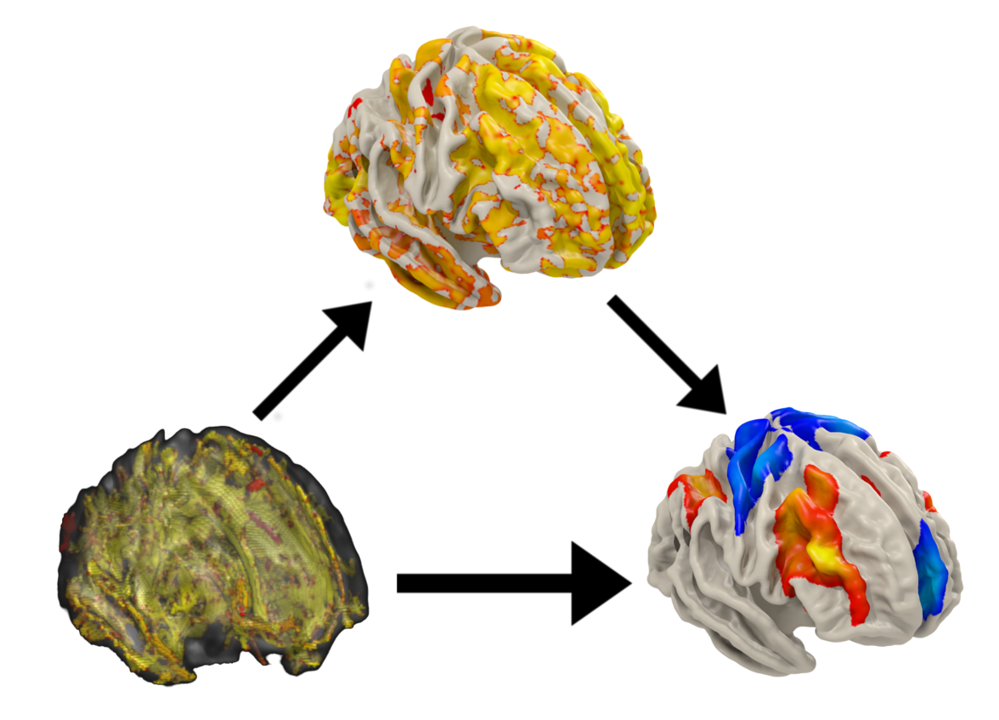

# TFCE_mediation
Fast regression and mediation analysis of vertex or voxel MRI data with TFCE

### Citation ###

[Lett TA, Waller L, Tost H, Veer IM, Nazeri A, Erk S, Brandl EJ, Charlet K, Beck A, Vollstädt-Klein S, Jorde A, Keifer F, Heinz A, Meyer-Lindenberg A, Chakravarty MM, Walter H. Cortical Surface-Based Threshold-Free Cluster Enhancement and Cortexwise Mediation. Hum Brain Mapp. 2017 March 20. DOI: 10.1002/hbm.23563](http://onlinelibrary.wiley.com/doi/10.1002/hbm.23563/full)

The pre-print manuscript is available [here](tfce_mediation/doc/Lett_et_al_2017_HBM_Accepted.pdf) as well as the [supporting information](tfce_mediation/doc/Lett_et_al_2017_HBM_supporting_information.docx).

### Installation ###
See wiki [Install TFCE_mediation](https://github.com/trislett/TFCE_mediation/wiki/Install-TFCE_mediation)

### Tutorials ###

See wikis:
[Work-flow example: Vertex-wise regression analyses](https://github.com/trislett/TFCE_mediation/wiki/Work-flow-example-for-vertex-wise-regression-analyses)

[Work-flow example: Voxel-wise mediation analyses](https://github.com/trislett/TFCE_mediation/wiki/Work-flow-example-for-voxel-wise-mediation-analyses)

Additional help:
* Every command and subcommand has an extensive help function (i.e., try -h)
* Ask in the [Issues](https://github.com/trislett/TFCE_mediation/issues) section, even if it is just a question.

### What's new / updates ###

19-07-2017

* version 1.2.2 is now available on [pypipe (PIP)](https://pypi.org/project/tfce-mediation/).
* fixes a bug in the permutation testing of surfaces with unequal sizes

5-07-2017

* version 1.2.1 is now available on [pypipe (PIP)](https://pypi.org/project/tfce-mediation/). 
* A number of small fixes have been made. 
* Release of an alpha version of multi-surface, multi-modality regression (mmr) analysis using the tmi image. The scripts can be found [here](https://github.com/trislett/TFCE_mediation/tree/master/tfce_mediation/tm_multisurface).
* [tm_multimodality_multisurface_regression.py](https://github.com/trislett/TFCE_mediation/blob/master/tfce_mediation/tm_multisurface/tm_multimodality_multisurface_regression.py) is still in the early stages but it already has many new features including:
	- In the same set of subjects, cortical thickness, surface area, neurite density, and fMRI contrast maps could be packaged in the a tmi file using [create_tmi.py](https://github.com/trislett/TFCE_mediation/blob/master/tfce_mediation/tools/create_tmi.py). Statistical analysis (and randomization) across all modalities can be performed using [tm_multimodality_multisurface_regression.py](https://github.com/trislett/TFCE_mediation/blob/master/tfce_mediation/tm_multisurface/tm_multimodality_multisurface_regression.py)
	- Study-wide FWE correction with TFCE. i.e., 1-p(FWE<0.05) images are produced that are corrected via a standardization algorithm and maximum TFCE values among all surfaces.
	- The results can be exported as ply files and viewed using Blender or meshlab. Alternatively, the tmi result files can be converted to mgh or nifti. 
	- Many surfaces can be analyzed at once. For example, analysis among all subcortical structures can be performed with TFCE and corrected for all surfaces (or even subcortical, cortical surfaces can be combined together in a single analysis). 
* Due to the flexibility of the tmi image format, many more features will be released in the new feature. For instance, the tmi format can include both voxel and vertex data in the same space. This allows voxel-based (such as TBSS) analyses and vertex-based (such cortical thickness) to be performed concurrently with TFCE and FWE correction among all data analyzed.
* TLDR, why do volumetric analyses when surface area and cortical thickness can be analyzed as the same time? Bonferroni correction among different imaging modalities is not necessary using [tm_multimodality_multisurface_regression.py](https://github.com/trislett/TFCE_mediation/blob/master/tfce_mediation/tm_multisurface/tm_multimodality_multisurface_regression.py) and the [tmi image format](https://github.com/trislett/TFCE_mediation/blob/master/tfce_mediation/tm_io.py).

21-06-2017

* version 1.2 is now available on [pypipe (PIP)](https://pypi.python.org/pypi/tfce-mediation/1.2.0)
* added the ability to read and write binarized PLY files using 'tm_tools convert-surface'
* a preview of the new tfce_mediation imaging (tmi) for format group analyses will be released before OHBM 2017. It is based on the the PLY file format. Some advantages include a fast, space efficient, and expandable neuroimaging that harmonizes voxel and vertex images as well as surfaces all with a file history function, but more on that later. 

16-05-2017

* added an option to use geodesic FWHM smoothing in tfce_mediation step0-vertex. Geodesic smoothing requires a distances list that can either be created using [fwhm_compute_distances_parallel.py](https://github.com/trislett/TFCE_mediation/tree/master/tfce_mediation/misc_scripts) or downloaded from [tm_addons](https://github.com/trislett/tm_addons). Currently, only the midthickness surface is supported, but other surfaces will be supported soon. 

13-05-2017

* convert-surface now supports painting freesurfer label files to .ply files as well as outputing a legend. An example of the lh aparc atlas on the midthickness surface is: [left view](https://github.com/trislett/tm_addons/blob/master/4kRender/lh.aparc.annot_left_1080p.png), [right view](https://github.com/trislett/tm_addons/blob/master/4kRender/lh.aparc.annot_right_1080p.png), [legend](https://github.com/trislett/tm_addons/blob/master/4kRender/lh.aparc.annot_legend.png), and the lh [Glasser et al. (2016)](http://www.nature.com/nature/journal/v536/n7615/abs/nature18933.html) HCP-MMC1 atlas: [left view](https://github.com/trislett/tm_addons/blob/master/4kRender/lh.HCP-MMP1.annot_left_1080p.png), [right view](https://github.com/trislett/tm_addons/blob/master/4kRender/lh.HCP-MMP1.annot_right_1080p.png), and a ridiculously long [legend](https://github.com/trislett/tm_addons/blob/master/4kRender/lh.HCP-MMP1.annot_legend.png)
* Support for loading 4D minc volumes with tfce_mediation step0-voxel. Right now the outputs will still be nifti (which could be converted to mnc e.g. by using nii2mnc).

05-05-2017

* convert-surface now supports exporting the [Polygon File Format (PLY)](https://en.wikipedia.org/wiki/PLY_(file_format)). Statistic files (*.mgh) can now be painted on the vertices with specifying a threshold range (e.g 0.95 1 for pFWE corrected images) with an either red-yellow or blue-lightblue color scheme (as well as all [matplotlib color schemes](https://matplotlib.org/examples/color/colormaps_reference.html)). So now you can 3D print your surface based results!
* A few examples of the high quality (3840x2160) render of painted results of the ?h.mean.area.00.mgh from 0.1mm to 1.0mm using the 'jet' colormap [right](https://github.com/trislett/tm_addons/blob/master/4kRender/MeanArea_transparent_right.png), [rostral](https://github.com/trislett/tm_addons/blob/master/4kRender/MeanArea_transparent_rostral.png), and [superior](https://github.com/trislett/tm_addons/blob/master/4kRender/MeanArea_transparent_superior.png). The surfaces were rendered using [Blender](https://www.blender.org/) and exported *.ply objects.
* A sample blender scene for making figures can be downloaded from [here](https://github.com/trislett/tm_addons/blob/master/BlenderScene/Sample_Scene.blend). n.b., when importing a new *ply object, the scale will need to be reduced. 
* wiki is slowly becoming alive

03-05-2017

* Added surface conversion tool (tm_tools convert-surface) for converting gifti / MNI objects / freesurfer .srf files to freesurfer .srf files for analysis with TFCE_mediation or waveform objects / Stl objects for importing the surface to 3D rendering software such as Blender or Meshlab. Among other things, this means that there is now full support for statistical analysis of neuroimages processed with CIVET. Here is an example of the midthickness surface [LH](https://github.com/trislett/tm_addons/blob/master/3dSurfaces/lh.midthickness.stl) and [RH](https://github.com/trislett/tm_addons/blob/master/3dSurfaces/rh.midthickness.stl).

02-05-2017

* Added fwhm_compute_distances_parallel to the misc_scripts directory. It is necessary for geodesic FWHM smoothing. 
* Full support for CIFTI-2 and GIFTI in the very near future.
* Version 1.1 is now available on pip 

21-04-2017

* Geodesic FWHM smoothing on the vertex images. It is performed on the midthickness surface. The runtime is approximately 4 minutes per image, but it can probably be faster. No more fudge factors!
* FWHM smoothing on voxel images.
* Too many additions to tm_maths than can be listed. Some examples are surface-based ICA artefact removal, curve fitting for calculation of the max TFCE null distribution of FWE correction, pca compression smoothing, many clustering algorithms, and powerful normalization tools. Check the help function.
* Initial support for CIVET vertex-based analyses (see the issues section)
* Version 1.1 will be pushed to pip in the near future. 
